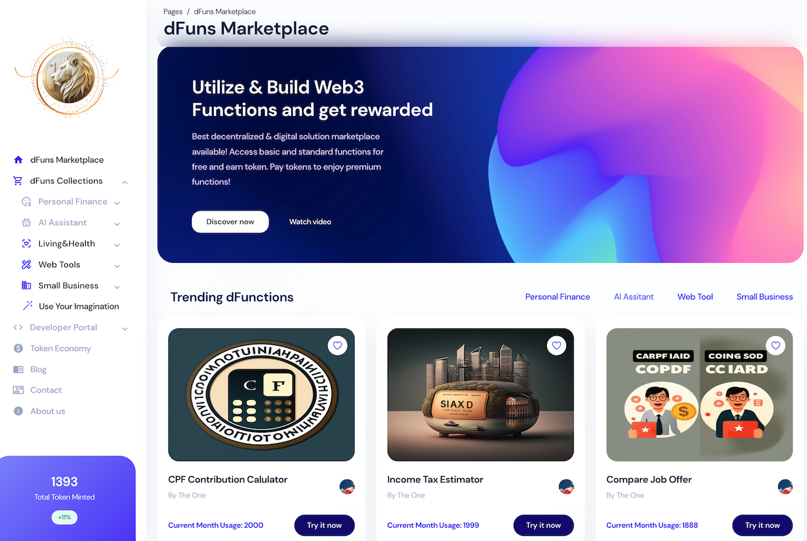
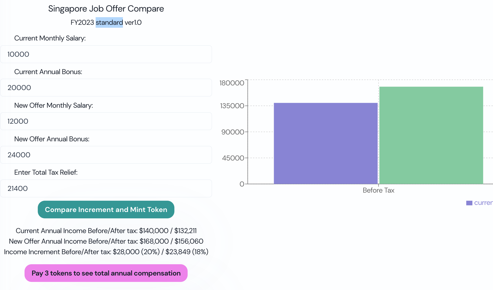
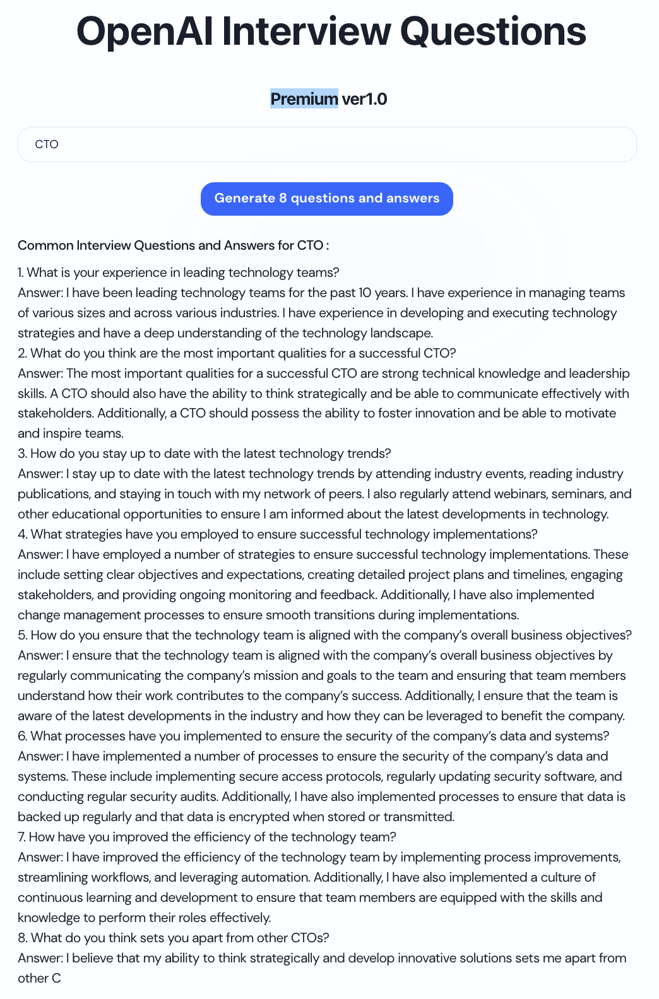

# Introduction

dFuns Marketplace created by OneBlockchain.sg - Do not re-produce if not authorized. All rights reserved.

A decentralized platform that offers free digital services to make your life 1% better, incentivizes user and developer engagement with a token economy, and prioritizes user privacy and security.



## decentralized Function as a Service (dFuns)
Each function resolves simple but essential problem in one's life, such as compare new job offer package, plan retirement saving, name your new born and many more.

Each dFun offers 3 tier of serivce: basic, standard and premium. 



## Quick Start

Run in terminal this command:

```bash
npm i 
```

Then run this command to start your local server

```bash
yarn dev
```

Build 

```bash
npm run build
```

### Copyright and license

⭐️ [Copyright 2023 ](https://demo.oneblockchain.sg)
